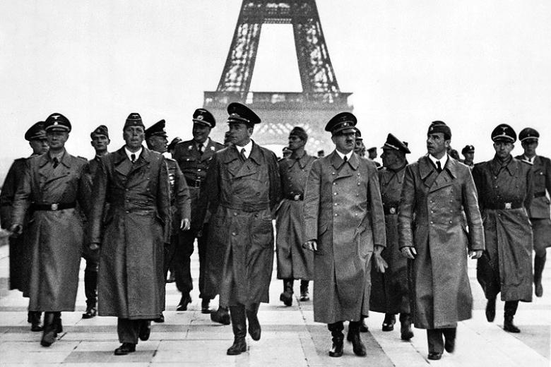

```{r setup, include=F}
knitr::opts_chunk$set(echo = FALSE)
```

## World War II

**There's barely a city in Europe that doesn't echo memories of World War II. With an abundance of battlefields, museums, and moving concentration camps to visit, it's hard for a history buff to know where to start.**



### We take a look at eight sites in Europe any history enthusiast should visit.

```{r, echo=FALSE}
df <- data.frame(lat = c(51.021075,50.034422,52.375153,51.502045,54.080553, 49.367513, 48.687012, 52.513967),
lng = c(2.345843, 19.176380, 4.884030, -0.129368, 21.494413, -0.877634, 44.490312, 13.378530))

places <- c("Dunkirk","Auschwitz-Birkenau","Anne Frank House","Churchill Museum and Cabinet War Rooms","The Wolfs Lair","Omaha Beach","Volgograd","Holocaust Memorial")
```

```{r, echo=FALSE}
library(leaflet)
df %>% leaflet() %>% addTiles() %>% addMarkers(popup = places)
```